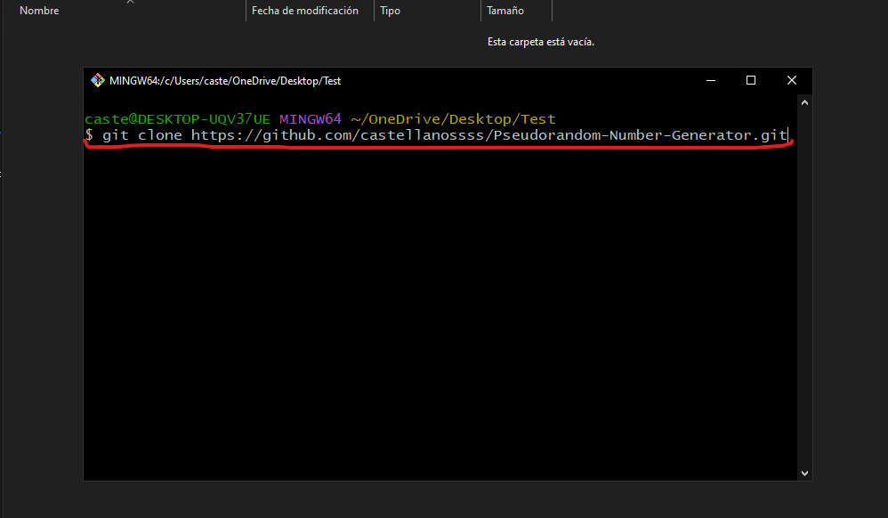

# Pseudo-random Number Generator

This program created in Python **generates pseudorandom numbers** through 5 methods: Middle Squares Method, Linear Congruence Method, 
Multiplicative Congruence Method, Uniform Distribution Method and Normal Distribution Method.

Please follow these series of **steps** to be able to run the program and avoid future errors:

_Hey, make sure you have **Git** installed on your computer._

## Clone the Project

1. Go to an empty folder and right-click to display the pop-up menu where you will select the "Open Git Bash here" option.
    
2. In the terminal, type the following command:

    `git clone https://github.com/castellanossss/Pseudorandom-Number-Generator.git`
    
    And wait for it to finish cloning the entire project from the repository
3. When you finish cloning, the project folder should appear.
    

Since the project was created in **Python**, we must make sure we have certain libraries installed...

## Required Python Libraries

For all these reviews, you must open the **cmd** of your computer.

### Let's check that we have the required libraries installed:
- Open **cmd** and type:

      > pip show numpy
    
    If you have it installed, you should see general information about this library. Like this:

    

    If nothing comes out, you must install the library with the following command:

      > pip install numpy

Run the same process for the following libraries: **pyqt6, matplotlib and scipy**.

Once you are sure that the **required libraries** are installed, let's move on to the next step...

## Running the Project

- Locate the project you just cloned and enter the folder.
    
- Open the project with the **IDE** or **Development Environment** you want, in my case I will use Spyder.
- Open the class called `Presenter.py`.
    
- Run the program with the Run File button at the top.
    

Perfect, if everything goes well and if you followed the steps you should already be seeing the graphical interface of the application.

Feel free to explore the interface and application.

**You can now generate your pseudorandom numbers!!**

## Important...
The program saves the numbers it generates with the parameters that you entered when you click the `Generate` button.

But...

**Where does the application save the text files with the numbers it just generated?**

To see those files that it generated, you must go to the folder where you cloned the project, and you will see a folder called `Numbers Generated`

Inside the folder, there will be the txt files with the generated **Ri numbers**. The name of the file will depend on the method by which you decided to generate the numbers. Here, as you can see, I generated numbers using the Uniform Distribution Method and the Linear Congruence Method.

The files will have written the **Ri numbers** that you will need to submit them to the **tests**.

That's all for now **:)**

## Authors

- Jaider Castellanos
- Thomas Sorza
- Laura Vanesa Fernandez
- Esteban Puentes
- Brayan Fuquene

**Simulación de Computadores - Grupo 1**

**UPTC Tunja 2023 - 2**
